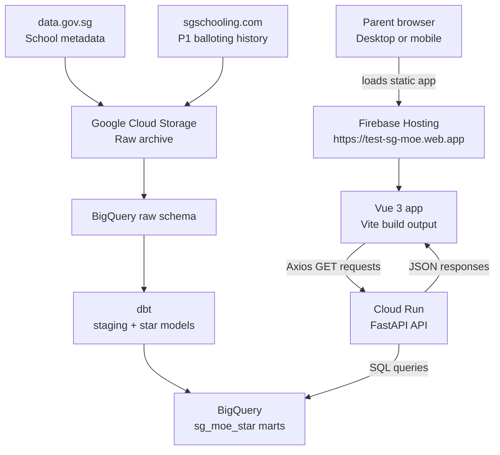

# SGPrimary - P1 Ballot Insights & School Recommendation Engine

> A data engineering and AI capstone project built on Singapore's Primary 1 (P1) registration balloting data.
> Designed to help parents make informed school choices and to demonstrate end-to-end data, API, frontend, and deployment engineering.

[](https://www.python.org/)
[](https://www.getdbt.com/)
[](https://cloud.google.com/bigquery)
[](https://cloud.google.com/storage)
[](https://fastapi.tiangolo.com/)
[](https://www.docker.com/)
[](https://cloud.google.com/run)
[](https://firebase.google.com/products/hosting)
[](https://vuejs.org/)

**Live app:** https://test-sg-moe.web.app  
**API base URL:** https://YOUR_CLOUD_RUN_URL.us-central1.run.app


---

## Table of Contents

- [Motivation](#motivation)
- [Project Goals](#project-goals)
- [Architecture Overview](#architecture-overview)
- [Frontend Stack](#frontend-stack)
- [Data Sources](#data-sources)
- [Key Design Decisions](#key-design-decisions)
- [API Endpoints](#api-endpoints)
- [Repository Structure](#repository-structure)
- [Known Limitations](#known-limitations)
- [Roadmap](#roadmap)
- [Setup Guide](#setup-guide)

---

## Motivation

As a parent preparing for my daughter's Primary 1 registration, I found the process of evaluating schools genuinely difficult. Balloting data is scattered across multiple websites, historical trends are not easily accessible, and there is no single tool that helps a parent reason about their actual chances of getting into a specific school.

This project is my attempt to solve that problem for myself and for other parents in my network.

It is also a portfolio project built during the **NTU SCTP Data Science and AI programme**, designed to demonstrate practical data engineering and AI engineering skills.

---

## Project Goals

1. **For parents** - provide a recommendation engine that surfaces schools with lower historical ballot difficulty based on location, phase, and school attributes.
2. **For portfolio** - demonstrate ingestion, transformation, data modelling, API development, frontend development, and cloud deployment.
3. **For learning** - build toward ML prediction and RAG-assisted school advice in a real Singapore education context.

---

## Architecture Overview

SGPrimary is now deployed as a full-stack application. Firebase Hosting serves the compiled Vue app, and the browser calls the FastAPI backend on Cloud Run. The backend queries BigQuery models built by the dbt pipeline.



Detailed frontend deployment and runtime diagrams are available in:

- [Full frontend architecture](./docs/frontend_architecture.md)
- [Vue project structure](./docs/vue_project_structure.md)

---

## Frontend Stack

| Tool | Role |
|---|---|
| Vue 3 | Component framework for the browser app |
| Vite | Local dev server and production build tool |
| Vue Router | Client-side routes for home, schools, recommendations, and school detail views |
| PrimeVue | UI component library |
| Tailwind CSS | Utility styling |
| Axios | Shared HTTP client for Cloud Run API calls |
| Firebase Hosting | Static hosting and CDN for `frontend/dist` |

See [frontend setup and deploy guide](./frontend/README.md).

---

## Data Sources

### 1. data.gov.sg - School Metadata

- **Dataset:** [General Information of Schools](https://data.gov.sg/datasets?topics=education&query=primary+&resultId=d_688b934f82c1059ed0a6993d2a829089)
- **Provider:** Singapore Government, data.gov.sg
- **Content:** School name, address, postal code, school type, SAP/autonomous/gifted/IP indicators, mother tongue, zone, principal and vice principal(s) details
- **Ingestion:** Python script (`scripts/load_schools_data.py`) via API call
- **Update frequency:** Annual — re-run script when MOE updates school metadata
- **Raw table:** `sg_moe.raw_schools`
- **File format in GCS:** CSV (one file per extraction date, with the latest being loaded into raw table)
- **Licence:** Singapore Open Data Licence 1.0

### 2. sgschooling.com - P1 Balloting History

- **Website:** [sgschooling.com](https://sgschooling.com)
- **Content:** Per-school, per-phase P1 balloting results, including vacancy, applied, taken, ballot scenarios, and ballot chance statistics
- **Years covered:** 2009-2025
- **Ingestion:** Python scraper (`scripts/scrape_sgschooling.py`) using BeautifulSoup with polite request intervals
- **Raw table:** `sg_moe.raw_sgschooling_balloting`
- **File format in GCS:** Parquet (one file per year)
- **Attribution:** Balloting history is sourced from sgschooling.com, which in turn sources from MOE's published P1 registration results. This project uses the data with permission from the site creator. For the most current and up-to-date balloting information, please visit [sgschooling.com](https://sgschooling.com) directly.

> **Note:** No official API exists for P1 balloting data on data.gov.sg. 
> sgschooling.com is the most comprehensive third-party aggregator of this 
> data, covering 17 years of history in a consistent, structured format. 
> Four potential sources were evaluated for the full comparison.

#### Why sgschooling.com as the sole balloting source

Four potential sources were evaluated:

| Source | Coverage | Decision | Reason |
|---|---|---|---|
| sgschooling.com | 2009–2025 | ✅ Primary source | Longest history, single clean HTML table per year, scrapable |
| MOE website | 2025 only | ❌ Not ingested | 18 paginated HTML pages, government site scraping risk, data already in sgschooling |
| elite.com.sg | 2019–2025 | ❌ Not ingested | Full overlap with sgschooling, dropdown-driven scraping complexity |
| sgschoolkaki.com | 2025 only | ❌ Not ingested | Third-party aggregator, single year, no benefit over sgschooling |

Data accuracy from sgschooling.com extraction was manually verified against MOE published figures and other sources after ingestion.

---

## Key Design Decisions

The main data modelling issues are documented in [Key Design Decisions](./key_design.md):

#### (1) School Name Reconciliation
- School names differ between data.gov.sg and sgschooling.com.

#### (2) Phase Structure Change in 2022
- MOE merged Phases 2A(1) and 2A(2) into a single Phase 2A from 2022 onwards.

#### (3) Missing Vacancy and Applied Figures Pre-2019
- For phases 1, 2A(1), and 2A(2), MOE did not publish vacancy and applied counts before 2019.

#### (4) School Lifecycle — Mergers and Relocations
- Several primary schools have ceased or temporarily suspended P1 registration due to mergers or subjected to relocations.

---

## API Endpoints

The SGPrimary API is built with FastAPI and deployed on Google Cloud Run.

**Base URL:** `{YOUR_CLOUD_RUN_URL}`

**Interactive docs:** `{base_url}/docs`

| Endpoint | Method | Description |
|---|---|---|
| `/health` | GET | Liveness check, API version, and status |
| `/schools` | GET | Active primary schools with optional attribute filters |
| `/school-detail` | GET | Detailed school profile and historical ballot context |
| `/recommend` | GET | School recommendations based on location, phase, attributes, and ballot history |
| `/predict` | GET | Heuristic ballot risk assessment for a school and phase |
| `/metadata` | GET | Dropdown/filter metadata for the frontend |

### `/schools` Query Parameters

| Parameter | Type | Required | Description |
|---|---|---|---|
| `zone_code` | string | No | Filter by zone: NORTH, SOUTH, EAST, WEST |
| `dgp_code` | string | No | Filter by estate, e.g. ADMIRALTY |
| `type_code` | string | No | Filter by school type |
| `nature_code` | string | No | Filter by school nature |
| `sap_ind` | boolean | No | SAP school indicator |
| `autonomous_ind` | boolean | No | Autonomous school indicator |
| `gifted_ind` | boolean | No | Gifted programme indicator |
| `ip_ind` | boolean | No | Integrated Programme indicator |

### `/recommend` Query Parameters

| Parameter | Type | Required | Description |
|---|---|---|---|
| `zone_code` | string | At least one of `zone_code` or `dgp_code` | Filter by zone |
| `dgp_code` | string | At least one of `zone_code` or `dgp_code` | Filter by estate |
| `phase` | string | No | Phase: 2B, 2C, 2C(S), 3. If omitted, returns all phases with most recent year only |
| `has_balloting_3yr` | boolean | No | Requires `phase`; filters by recent ballot occurrence |
| `type_code` | string | No | Filter by school type |
| `nature_code` | string | No | Filter by school nature |
| `sap_ind` | boolean | No | SAP school indicator |
| `autonomous_ind` | boolean | No | Autonomous school indicator |
| `gifted_ind` | boolean | No | Gifted programme indicator |
| `ip_ind` | boolean | No | Integrated Programme indicator |

### `/predict` Query Parameters

| Parameter | Type | Required | Description |
|---|---|---|---|
| `school_name` | string | Yes | Full school name, e.g. ADMIRALTY PRIMARY SCHOOL |
| `phase` | string | Yes | Phase: 2B, 2C, 2C(S), 3 |

### Response Modes for `/recommend`

**Mode 1 — No phase selected:**
Returns all phases for matching schools. Each phase shows the most recent completed year plus the current year (2026) if registration data is available.

**Mode 2 — Phase selected:**
Returns the selected phase for matching schools with the last 3 completed years of history, trend features (`subscription_rate_3yr_avg`, `ballot_occurrences_last_3yr` etc.), and `reference_years` showing the exact years used for trend computation.


---

## Repository Structure

```text
NTU_Capstone_SGPrimary/
├── .firebaserc                     # Firebase project alias: test-sg-moe
├── firebase.json                   # Firebase Hosting config for frontend/dist
├── README.md
├── setup_guide_api.md              # API local development and Cloud Run deploy guide
├── setup_guide_data_pipeline.md    # Data pipeline setup guide
├── docs/
│   ├── frontend_architecture.md
│   ├── vue_project_structure.md
│   └── parent_feedback.md
├── frontend/
│   ├── README.md                   # Frontend setup and Firebase deploy guide
│   ├── package.json
│   ├── vite.config.js
│   ├── tailwind.config.js
│   ├── public/
│   └── src/
│       ├── services/               # Axios API client and metadata calls
│       ├── router/                 # Vue Router routes
│       ├── views/                  # Home, schools, recommendations, detail views
│       └── components/             # Shared UI components
├── api/
│   ├── main.py                     # FastAPI app, routers, CORS, handlers
│   ├── config.py                   # Settings and BigQuery client
│   ├── constants.py
│   ├── Dockerfile                  # Cloud Run container definition
│   ├── requirements.txt            # API-specific Python dependencies
│   ├── routers/                    # GET methods
│   ├── models/                     # Pydantic responses
│   ├── services/                   # Business logic
│   └── postman/
├── scripts/                        # Data ingestion scripts
├── sg_primary_dbt/                 # dbt project, models, seeds
└── keys/                           # Local GCP keys, gitignored
```

### Schema Overview

| Schema | Tables | Description |
|---|---|---|
| `sg_moe` | `raw_schools`, `raw_sgschooling_balloting` | Raw ingested data |
| `sg_moe_seeds` | `phases`, `balloting_codes`, `school_lifecycle`, `school_name_mapping`, `school_statuses` | Reference and mapping tables |
| `sg_moe_staging` | `stg_all_schools`, `stg_primary_schools`, `stg_sgschooling_balloting` | Cleaned intermediate models |
| `sg_moe_star` | `dim_school`, `dim_school_generalinfo`, `fact_balloting`, `mart_school_analysis` | API-ready analytical models |

### dbt DAG (Directed Acyclic Graph)

```
raw_schools                    raw_sgschooling_balloting
      │                                    │
      │                    + school_name_mapping (seed)
      │                    + phases (seed)
      ▼                                    ▼
stg_all_schools              stg_sgschooling_balloting
stg_primary_schools
      │                                    │
      ▼                                    ▼
dim_school  ◄──────────────────── fact_balloting
dim_school_generalinfo                     │
                                           ▼
                               mart_school_analysis
```

---

## Known Limitations

| Limitation | Impact | Notes |
|---|---|---|
| Vacancy and applied figures unavailable for phases 1, 2A(1), 2A(2) before 2019 | ML features for early phases are incomplete pre-2019 | MOE did not publish those figures |
| sgschooling.com data accuracy | Dependent on third-party aggregation | Manually verified against MOE published figures where possible |
| School metadata is a point-in-time snapshot | Principal names and contact details can go stale | Scheduled ingestion and SCD modelling are future work |
| Pre-2015 data may have lower predictive value | Older demand patterns may not predict current behaviour | Consider year weighting for ML training |
| 2021-2022 data may reflect COVID anomalies | Subscription rates may be atypical | Flag these years during feature engineering |
| OneMap distance calculation not yet implemented | Parents currently filter by area rather than exact home distance | Planned future iteration |
| Phases 1 and 2A excluded from `/recommend` and `/predict` | Some families cannot model sibling/alumni phases yet | Planned future iteration |
| `/predict` is heuristic | Risk level is rule-based, not a trained ML prediction | ML model remains a future enhancement |

---

## Roadmap

| Milestone | Focus | Status |
|---|---|---|
| Week 1 | Data foundation: ingestion, GCS, BigQuery, dbt pipeline | ✅ Complete |
| Week 2 | FastAPI endpoints, Docker image, Cloud Run deployment | ✅ Complete |
| Week 3 | Vue frontend, API integration, production build, Firebase Hosting, desktop/mobile smoke test | ✅ Complete |
| Feedback round | Share live app with 3-5 parents and collect usability feedback | 🔄 In progress |
| Week 4 | ML model — ballot probability and subscription rate prediction for 2026 | 🔜 Upcoming |
| Week 5 | RAG layer — ChromaDB vector store, LLM-powered school advice, frontend | 🔜 Upcoming |
| Week 6 | Prioritize parent feedback | 🔜 Upcoming |

Feedback collection template: [docs/parent_feedback.md](./docs/parent_feedback.md)

---

## Setup Guide

- Data pipeline setup: [setup_guide_data_pipeline.md](./setup_guide_data_pipeline.md)
- API local development and Cloud Run deployment: [setup_guide_api.md](./setup_guide_api.md)
- Frontend local development and Firebase deployment: [frontend/README.md](./frontend/README.md)
- Frontend architecture: [docs/frontend_architecture.md](./docs/frontend_architecture.md)
- Vue project structure: [docs/vue_project_structure.md](./docs/vue_project_structure.md)

---

*Built as part of the NTU SCTP Data Science and AI programme capstone project.*  
*Author: Khoon Seng | [GitHub](https://github.com/khoonseng)*
