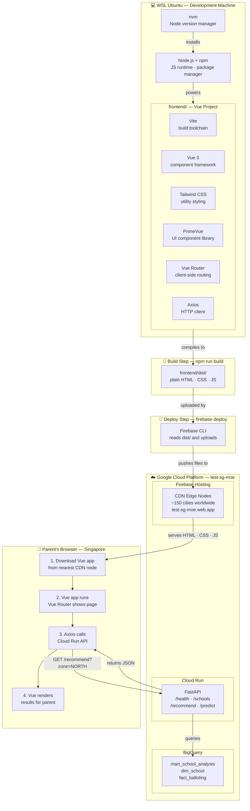
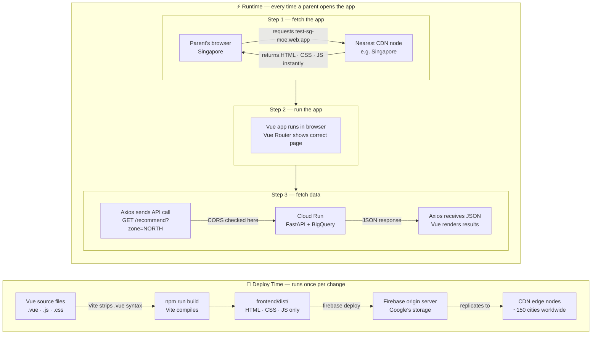

# SGPrimary — Architecture Documentation

This document covers two architecture perspectives:

1. [Full Stack Architecture](#1-full-stack-architecture) — how all components fit together end-to-end
2. [Firebase Hosting — How the Vue App is Served](#2-firebase-hosting--how-the-vue-app-is-served) — the deploy and runtime journey in detail

---

## 1. Full Stack Architecture

This diagram shows the complete system — from your WSL development machine through to a parent's browser.

### Component Reference

| Component | Layer | Role |
|---|---|---|
| nvm | Dev machine | Installs and manages Node.js versions — like pyenv for Python |
| Node.js + npm | Dev machine | JS runtime and package manager — required to run Vite and install packages |
| Vite | Build toolchain | Dev server (`npm run dev`) and compiler (`npm run build`) — converts `.vue` files to plain HTML/CSS/JS |
| Vue 3 | Frontend framework | Component framework — lets you write reusable UI pieces as `.vue` files |
| Tailwind CSS | Styling | Utility-first CSS — style via class names (`text-red-500`, `p-4`) instead of writing CSS |
| PrimeVue | UI components | Pre-built dropdowns, tables, cards, badges — saves building from scratch |
| Vue Router | Navigation | Client-side routing between `/schools`, `/recommend` — no server roundtrip per page |
| Axios | HTTP client | Makes API calls to Cloud Run — sends requests, receives JSON responses |
| Firebase CLI | Deploy tool | Uploads `frontend/dist/` to Firebase Hosting via `firebase deploy` |
| Firebase Hosting | CDN | Serves static files to browsers worldwide — no server computation |
| Cloud Run | Backend | Runs FastAPI, computes responses, queries BigQuery on each API call |
| BigQuery | Data warehouse | Stores `mart_school_analysis`, `dim_school`, `fact_balloting` — source of truth |

---

## 2. Firebase Hosting — How the Vue App is Served

This diagram zooms into Firebase Hosting specifically — showing what happens at deploy time and at runtime.

### Key Insight — Two Different Roles

| | Firebase Hosting | Cloud Run |
|---|---|---|
| **Analogy** | Bookshelf — books already printed, just handed out | Kitchen — every order cooked fresh on demand |
| **What it serves** | Static files — same HTML/CSS/JS for every visitor | Dynamic responses — different JSON per API call |
| **Computation** | None — pure file delivery | Yes — Python code runs, BigQuery queried |
| **When it runs** | Immediately, from nearest CDN node | On each API request, 50–200ms response time |
| **Cost** | Free tier — 10GB storage, 360MB/day transfer | Billed per request and compute time |
| **Do they talk to each other?** | No — the parent's browser connects them | No — Cloud Run never calls Firebase |

> **Important:** Firebase Hosting and Cloud Run never communicate directly.
> The parent's browser is the only bridge between the two — it downloads
> the Vue app from Firebase, then makes API calls directly to Cloud Run.

---

*This document was created as part of the SGPrimary capstone project.*
*Author: Khoon Seng*
