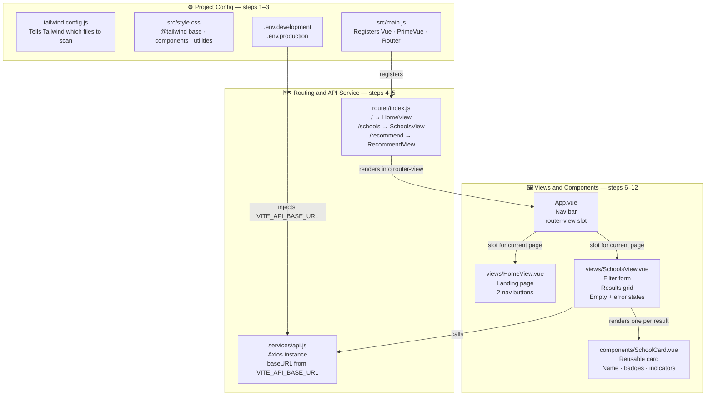
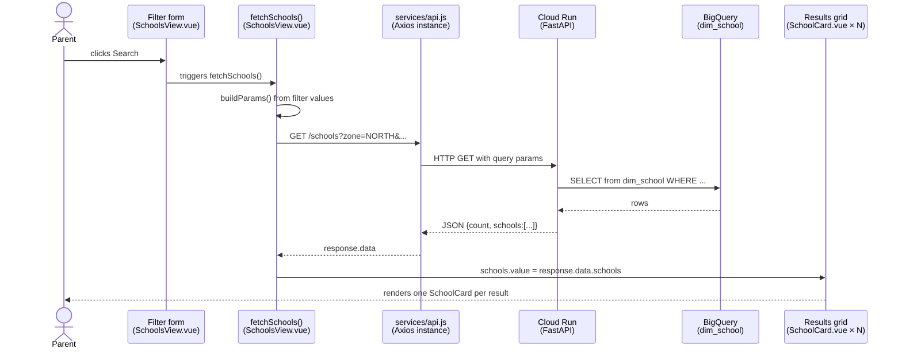
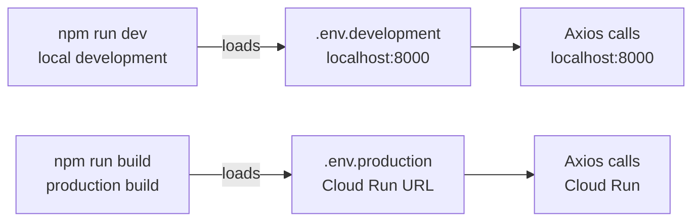
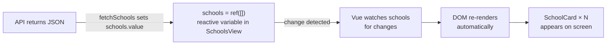

# Frontend Architecture — Vue Project Structure

This document explains the frontend file structure, how the layers connect, and the runtime data flow. Use it as a reference when modifying existing features or adding new ones.

---

## 1. Project File Structure

---

## 2. Runtime Data Flow — what happens when a parent clicks Search

---

## 3. Component Responsibilities

| File | Layer | Responsibility | Modify when... |
|---|---|---|---|
| `tailwind.config.js` | Config | Tells Tailwind which files to scan for class names | Adding a new file type (e.g. `.ts`) |
| `src/style.css` | Config | Loads Tailwind layers, defines reusable CSS utilities (`.badge`, `.filter-select`) | Adding a new reusable CSS class |
| `.env.development` | Config | Sets `VITE_API_BASE_URL` to `localhost:8000` for local dev | Changing the local API port |
| `.env.production` | Config | Sets `VITE_API_BASE_URL` to Cloud Run URL for production builds | Redeploying API to a new Cloud Run URL |
| `src/main.js` | Entry point | Creates the Vue app, registers PrimeVue and Vue Router | Adding a new global plugin or library |
| `router/index.js` | Routing | Maps URL paths to view components | Adding a new page |
| `services/api.js` | API service | Single Axios instance shared across all views | Adding auth headers, changing timeout, adding interceptors |
| `App.vue` | Shell | Permanent nav bar + `<router-view>` slot for page content | Changing the nav bar, adding a footer |
| `views/HomeView.vue` | View | Landing page with navigation buttons | Changing the home page copy or layout |
| `views/SchoolsView.vue` | View | Filter form, API call, results grid, empty/error states | Adding a new filter, changing results layout |
| `views/RecommendView.vue` | View | Recommend page (built in Day 3) | Adding recommend filters or results |
| `components/SchoolCard.vue` | Component | Reusable school card — name, badges, special indicators | Changing how any school card looks across the whole app |

---

## 4. How Vite Selects the API URL

Vite automatically loads the correct `.env` file based on the command used. No code changes are needed between local development and production — only the build command differs.

---

## 5. Vue Reactivity — why the UI updates automatically

`ref()` and `reactive()` are Vue's reactivity primitives. When `schools.value` is updated after an API response, Vue detects the change and re-renders only the affected part of the DOM — no manual DOM manipulation needed. This is the core value of using Vue over plain JavaScript.

---

*This document covers the frontend structure as of Week 3 Day 2.*
*For the full stack architecture, see [architecture.md](architecture.md).*
